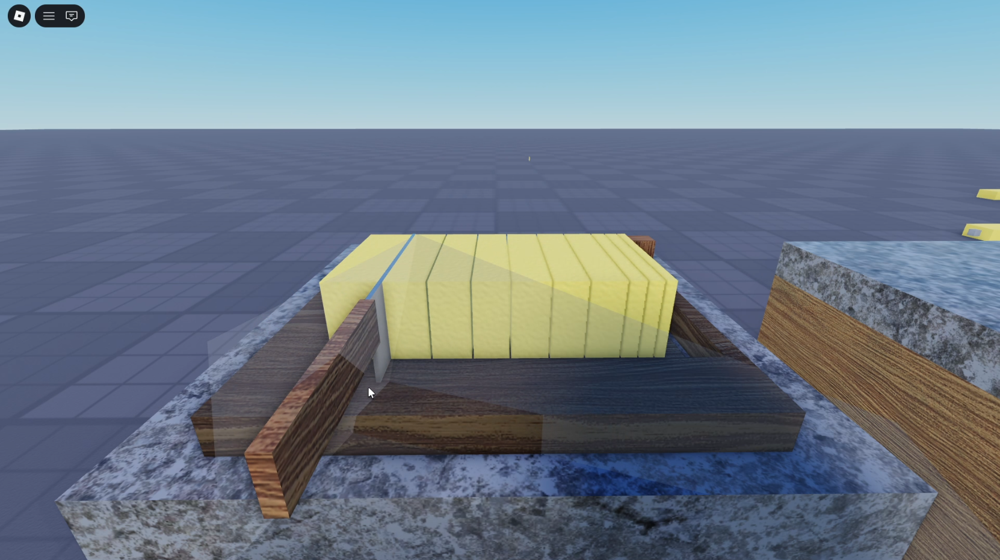

# Chopping

This project demonstrates the implementation of a **chopping** mechanic for a multiplayer cooking game. It focuses on how ingredient can be cut into multiple slices through player interaction, and is designed as a **standalone subsystem** intended to be integrated into a larger upcoming project.

This system is implemented using **Entity Component System (ECS)** architecture, emphasizing clear separation between data, behavior, and interaction logic.

## Demo

